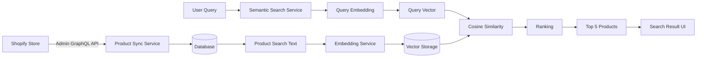

# README — VUCCI Shopify App

## 1. Installation

### 1.1. Requirements

Project yêu cầu các môi trường sau:

- Node.js
- npm
- Git
- Shopify CLI

Kiểm tra phiên bản:

```bash
node -v
npm -v
git --version
shopify version
```

### 1.2. Clone project

```bash
git clone <YOUR_REPOSITORY_URL>
cd vucci-app
```

### 1.3. Install dependencies

```bash
npm install
```

### 1.4. Configure environment

Tạo file `.env` từ `.env.example`:

```bash
cp .env.example .env
```

Trên Windows PowerShell có thể sao chép thủ công:

```powershell
Copy-Item .env.example .env
```

Sau đó cấu hình các biến môi trường trong `.env`.

### 1.5. Generate Prisma Client

```bash
npx prisma generate
```

### 1.6. Validate Prisma Schema

```bash
npx prisma validate
```

### 1.7. Apply database migrations

Development:

```bash
npx prisma migrate dev
```

Production:

```bash
npx prisma migrate deploy
```

### 1.8. Run the Shopify App

```bash
shopify app dev
```

Shopify CLI sẽ khởi động ứng dụng ở môi trường development và tạo development preview để mở app trong Shopify Admin.

---

## 2. Configuration

Ứng dụng sử dụng file `.env` để lưu các thông tin cấu hình.

Ví dụ:

```env
SHOPIFY_API_KEY=your_shopify_api_key
SHOPIFY_API_SECRET=your_shopify_api_secret

SHOPIFY_APP_URL=https://your-app-url.example.com

SCOPES=read_products

DATABASE_URL=file:dev.sqlite

OPENAI_API_KEY=your_openai_api_key
EMBEDDING_MODEL=text-embedding-3-small
```

### Environment Variables

| Variable | Required | Description |
|---|---|---|
| `SHOPIFY_API_KEY` | Yes | Client ID của Shopify App |
| `SHOPIFY_API_SECRET` | Yes | Client Secret của Shopify App |
| `SHOPIFY_APP_URL` | Yes | URL của Shopify App |
| `SCOPES` | Yes | Shopify API access scopes |
| `DATABASE_URL` | Yes | Connection string của database |
| `OPENAI_API_KEY` | Yes* | API key của OpenAI Embedding |
| `EMBEDDING_MODEL` | Yes* | Model dùng để tạo embedding |

`*` phụ thuộc vào embedding provider được cấu hình trong project.

### Security

Không commit file `.env` hoặc các secret lên Git.

Các thông tin nhạy cảm gồm:

```text
SHOPIFY_API_SECRET
SHOPIFY_API_KEY
OPENAI_API_KEY
Access Token
Database credentials
```

Repository chỉ nên chứa:

```text
.env.example
```

để mô tả cấu hình cần thiết.

---

## 3. Shopify Setup

### 3.1. Development Store

Project được phát triển và kiểm thử trên Shopify Development Store.

Development Store được dùng làm môi trường thử nghiệm để:

- Cài đặt Shopify App
- Kiểm tra Authentication
- Kiểm tra Admin API
- Kiểm tra Product Synchronization
- Kiểm tra Webhook

Ví dụ:

```text
https://vucci-k27ubgmn.myshopify.com
```

### 3.2. Create Shopify App

Project được khởi tạo bằng Shopify CLI:

```bash
shopify app init
```

Template:

```text
React Router
```

Language:

```text
TypeScript
```

### 3.3. Embedded App

Ứng dụng được cấu hình để chạy bên trong Shopify Admin.

Trong `shopify.app.toml`:

```toml
embedded = true
```

### 3.4. Shopify Server Configuration

Cấu hình Shopify App nằm trong:

```text
app/shopify.server.ts
```

Các thành phần chính:

```text
API Key
API Secret
API Version
Access Scopes
App URL
Session Storage
Authentication
Webhook Registration
```

Ví dụ:

```ts
const shopify = shopifyApp({
  apiKey: process.env.SHOPIFY_API_KEY,
  apiSecretKey: process.env.SHOPIFY_API_SECRET || "",
  apiVersion: ApiVersion.July26,
  scopes: process.env.SCOPES?.split(","),
  appUrl: process.env.SHOPIFY_APP_URL || "",
  authPathPrefix: "/auth",
  sessionStorage: new PrismaSessionStorage(prisma),
  distribution: AppDistribution.AppStore,
});
```

### 3.5. Access Scope

Ứng dụng sử dụng quyền đọc Product để phục vụ Product Synchronization:

```text
read_products
```

Scope này được sử dụng để đọc dữ liệu Product và Product Variant từ Shopify.

Nếu trong tương lai ứng dụng cần chỉnh sửa Product trực tiếp trên Shopify thì cần bổ sung quyền ghi Product tương ứng.

### 3.6. Admin GraphQL API

Ứng dụng sử dụng Shopify Admin GraphQL API để truy xuất Product.

Ví dụ:

```graphql
query GetProducts($first: Int!, $after: String) {
  products(first: $first, after: $after) {
    nodes {
      id
      title
      description
      vendor
      productType
      tags
      createdAt
      updatedAt

      variants(first: 100) {
        nodes {
          id
          title
          sku
          price
          compareAtPrice
          availableForSale

          selectedOptions {
            name
            value
          }
        }
      }

      media(first: 5) {
        nodes {
          id
          alt

          ... on MediaImage {
            image {
              url
            }
          }
        }
      }
    }

    pageInfo {
      hasNextPage
      endCursor
    }
  }
}
```

### 3.7. Webhooks

Ứng dụng sử dụng Shopify Webhook để đồng bộ Product khi dữ liệu thay đổi:

```text
products/create
products/update
products/delete
```

---

## 4. Database

### 4.1. Database được sử dụng

Ứng dụng sử dụng:

```text
SQLite
```

và ORM:

```text
Prisma
```

Database development:

```text
dev.sqlite
```

### 4.2. Prisma

Prisma được sử dụng để:

- Quản lý database schema
- Migration
- Query database
- Upsert Product
- Upsert Product Variant
- Lưu Shopify Session

Các lệnh thường dùng:

```bash
npx prisma generate
npx prisma validate
npx prisma migrate dev
npx prisma migrate status
npx prisma studio
```

### 4.3. Session

Model `Session` được sử dụng để lưu Shopify Authentication Session.

Các dữ liệu chính:

```text
id
shop
state
isOnline
scope
expires
accessToken
userId
firstName
lastName
email
accountOwner
locale
collaborator
emailVerified
refreshToken
refreshTokenExpires
```

### 4.4. Product

Model `Product` lưu dữ liệu Product đồng bộ từ Shopify.

Các trường chính:

```text
id
shopifyProductId
title
description
vendor
productType
tags
imageUrl
shopifyCreatedAt
shopifyUpdatedAt
syncedAt
dataHash
createdAt
updatedAt
deletedAt
```

Trong đó:

- `shopifyProductId`: ID của Product trên Shopify.
- `shopifyCreatedAt`: thời điểm Product được tạo trên Shopify.
- `shopifyUpdatedAt`: thời điểm Product được cập nhật trên Shopify.
- `syncedAt`: thời điểm app đồng bộ Product gần nhất.
- `dataHash`: hash của nội dung được sử dụng cho Semantic Search.
- `deletedAt`: thời điểm Product được đánh dấu đã xóa.

`shopifyProductId` được đặt `UNIQUE` để tránh Product bị tạo trùng.

### 4.5. Product Variant

Model `ProductVariant` lưu dữ liệu Variant:

```text
id
productId
shopifyVariantId
title
sku
price
compareAtPrice
availableForSale
options
```

Quan hệ:

```text
Product 1
   │
   ├── ProductVariant
   ├── ProductVariant
   └── ProductVariant
```

`shopifyVariantId` được đặt `UNIQUE` để đảm bảo idempotent synchronization.

### 4.6. Database Relationship

```text
Session

Product
  │
  └── ProductVariant
```

Trong quá trình mở rộng Semantic Search, Product có thể được liên kết với Vector record tương ứng.

---

## 5. Embedding

### 5.1. Mục đích

Embedding được sử dụng để chuyển dữ liệu Product thành một vector biểu diễn ngữ nghĩa.

Pipeline:

```text
Product Data
      ↓
Product Search Text
      ↓
Embedding Model
      ↓
Embedding Vector
```

### 5.2. Product Search Text

Trước khi tạo embedding, Product được chuyển thành một đoạn văn bản đại diện.

Ví dụ:

```text
Tên sản phẩm: iPhone 17 Pro Max

Nhà cung cấp: Apple

Loại sản phẩm: Smartphone

Mô tả:
Điện thoại cao cấp...

Tags:
iphone, apple, smartphone

Variants:
256GB / Black
512GB / Black
1TB / Natural Titanium

Giá:
34990000 - 39990000
```

Các trường chính được sử dụng:

```text
Title
Description
Vendor
Product Type
Tags
Variants
Price
```

### 5.3. Embedding Provider

Embedding Provider được cấu hình thông qua environment variables:

```env
OPENAI_API_KEY=your_api_key
EMBEDDING_MODEL=text-embedding-3-small
```

Ví dụ model:

```text
text-embedding-3-small
```

Model thực tế phải được đồng bộ với cấu hình hiện tại của project.

### 5.4. Embedding Vector

Sau khi gửi Product Search Text tới Embedding Provider, hệ thống nhận về một vector:

```text
[
  0.012,
  -0.045,
  0.123,
  ...
]
```

Vector này đại diện cho nội dung ngữ nghĩa của Product.

### 5.5. Data Hash Optimization

Trước khi tạo embedding, hệ thống tính SHA-256 hash:

```text
Product Data
      ↓
Normalize
      ↓
Search Text
      ↓
SHA-256
      ↓
dataHash
```

Khi Product được cập nhật:

```text
Old dataHash
      ↓
New dataHash
```

Nếu:

```text
oldHash === newHash
```

thì nội dung semantic không thay đổi và không cần tạo embedding mới.

Nếu:

```text
oldHash !== newHash
```

thì tạo embedding mới và cập nhật vector.

### 5.6. Inventory Change

Nếu chỉ thay đổi Inventory:

```text
Inventory:
20 → 19
```

nhưng các dữ liệu semantic:

```text
Title
Description
Vendor
Product Type
Tags
Variants
Price
```

không thay đổi thì `dataHash` không thay đổi.

Do đó:

```text
Không tạo embedding mới
```

Điều này giúp giảm chi phí API và tránh xử lý không cần thiết.

---

## 6. Vector Search

### 6.1. Mục đích

Vector Search được sử dụng để tìm Product có nội dung ngữ nghĩa gần với truy vấn của người dùng.

Ví dụ:

```text
áo nam màu đen dưới 500k
```

hoặc:

```text
điện thoại cao cấp 512GB
```

### 6.2. Product Vector

Mỗi Product sau khi embedding sẽ có một vector tương ứng:

```text
Product
   ↓
Search Text
   ↓
Embedding
   ↓
Vector
```

Vector được lưu cùng metadata liên quan:

```text
productId
embedding
model
dimensions
contentHash
createdAt
updatedAt
```

`productId` được sử dụng để liên kết vector với Product gốc.

### 6.3. Query Vector

Khi người dùng nhập query:

```text
áo nam màu đen dưới 500k
```

hệ thống cũng tạo embedding:

```text
User Query
     ↓
Embedding Model
     ↓
Query Vector
```

Sau đó Query Vector được so sánh với các Product Vector.

### 6.4. Cosine Similarity

Độ tương đồng giữa Query Vector và Product Vector được tính bằng Cosine Similarity:

```text
                    Q · P
Cosine(Q,P) = ---------------------
              ||Q|| × ||P||
```

Trong đó:

```text
Q = Query Vector
P = Product Vector
```

Giá trị càng cao thì hai vector càng tương đồng về mặt ngữ nghĩa.

### 6.5. Ranking

Các Product được sắp xếp theo Similarity Score giảm dần:

```text
Product A → 0.94
Product B → 0.89
Product C → 0.83
Product D → 0.79
Product E → 0.74
```

Sau đó hệ thống trả về:

```text
Top 5 Products
```

### 6.6. Search Result

Kết quả Semantic Search gồm tối thiểu:

```text
Product Image
Product Title
Price
Similarity Score
```

Ví dụ:

```text
Product: iPhone 17 Pro Max
Price: 39.990.000 ₫
Similarity: 92.4%
```

### 6.7. Deleted Product

Product có:

```text
deletedAt != null
```

sẽ không được trả về trong kết quả Semantic Search.

Vector tương ứng cũng được loại bỏ hoặc vô hiệu hóa.

---

## 7. Architecture

### 7.1. Tổng quan

Luồng dữ liệu chính:

```text
Shopify Store
      ↓
Shopify Admin GraphQL API
      ↓
Product Sync Service
      ↓
Database
      ↓
Product Search Text
      ↓
Embedding Service
      ↓
Vector Storage
      ↓
Semantic Search
      ↓
Top 5 Products
```

### 7.2. Architecture Diagram



### 7.3. Product Synchronization Flow

```text
Merchant
   ↓
Sync Products
   ↓
Shopify Admin GraphQL API
   ↓
Cursor Pagination
   ↓
Product Sync Service
   ↓
Normalize Product
   ↓
Upsert Product
   ↓
Upsert Product Variants
   ↓
Calculate dataHash
   ↓
Embedding Service
   ↓
Vector Storage
```

### 7.4. Webhook Flow

```text
Shopify
   ↓
products/create
products/update
products/delete
   ↓
Webhook Handler
   ↓
Verify Webhook
   ↓
Identify Product
   ↓
Upsert / Update / Soft Delete
   ↓
Calculate dataHash
   ↓
Create / Update / Remove Vector
```

### 7.5. Semantic Search Flow

```text
User
   ↓
Natural Language Query
   ↓
Query Embedding
   ↓
Query Vector
   ↓
Compare with Product Vectors
   ↓
Cosine Similarity
   ↓
Ranking
   ↓
Top 5 Products
   ↓
Search Result UI
```

### 7.6. Data Synchronization and Vector Pipeline

```text
                    ┌─────────────────────┐
                    │   Shopify Store     │
                    └──────────┬──────────┘
                               │
                               ▼
                    ┌─────────────────────┐
                    │ Admin GraphQL API   │
                    └──────────┬──────────┘
                               │
                               ▼
                    ┌─────────────────────┐
                    │ Product Sync        │
                    │ Service             │
                    └──────────┬──────────┘
                               │
                               ▼
                    ┌─────────────────────┐
                    │ Database            │
                    │ Product + Variant   │
                    └──────────┬──────────┘
                               │
                               ▼
                    ┌─────────────────────┐
                    │ Product Text        │
                    └──────────┬──────────┘
                               │
                               ▼
                    ┌─────────────────────┐
                    │ Embedding Service   │
                    └──────────┬──────────┘
                               │
                               ▼
                    ┌─────────────────────┐
                    │ Vector Storage      │
                    └──────────┬──────────┘
                               │
                               │
          ┌────────────────────┘
          │
          ▼
┌─────────────────────┐
│ Semantic Search     │
└──────────┬──────────┘
           │
           ▼
┌─────────────────────┐
│ Top 5 Products      │
└─────────────────────┘
```
