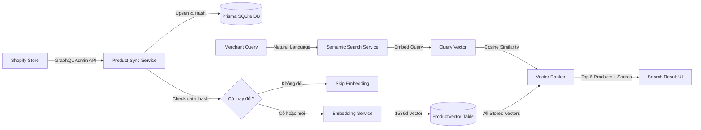

# VUCCI Shopify App - Product Synchronization & Semantic Vector Search

---

## 📑 Mục lục
1. [Tính Năng Chính](#tính-năng-chính)
2. [Kiến Trúc Hệ Thống (Architecture)](#kiến-trúc-hệ-thống-architecture)
3. [Cài Đặt & Hướng Dẫn Chạy (Installation)](#cài-đặt--hướng-dẫn-chạy-installation)
4. [Cấu Hình Môi Trường (Configuration)](#cấu-hình-môi-trường-configuration)
5. [Cấu Hình Shopify App (Shopify Setup)](#cấu-hình-shopify-app-shopify-setup)
6. [Cơ Sở Dữ Liệu & Schema (Database Design)](#cơ-sở-dữ-liệu--schema-database-design)
7. [Mô Hình Embedding & Chiến Lược Vector (Vector Storage & Search)](#mô-hình-embedding--chiến-lược-vector-vector-storage--search)
8. [Tối Ưu Hóa & Cơ Chế Webhooks](#tối-ưu-hóa--cơ-chế-webhooks)
9. [Trả Lời 5 Câu Hỏi Bắt Buộc (Mandatory Questions)](#trả-lời-5-câu-hỏi-bắt-buộc-mandatory-questions)

---

## 🚀 Tính Năng Chính

- **Shopify Embedded App:** Chạy trực tiếp trong giao diện Shopify Admin với xác thực OAuth 2.0 chuẩn xác và Session Storage an toàn.
- **Phân trang GraphQL thông minh:** Đồng bộ toàn bộ sản phẩm của cửa hàng với cơ chế Cursor-based Pagination (`hasNextPage`, `endCursor`).
- **Pipeline Vector Hóa Tự Động:** Chuyển đổi dữ liệu thuộc tính sản phẩm (Tên, Mô tả, Vendor, Loại, Tags, Biến thể, Giá) thành văn bản đại diện và sinh Vector Embedding 1536 chiều.
- **Tìm Kiếm Ngữ Nghĩa (Semantic Search):** Tìm kiếm sản phẩm theo ngôn ngữ tự nhiên (ví dụ: *"áo nam màu đen dưới 500k"*, *"snowboard mùa đông cao cấp"*) thông qua thuật toán Cosine Similarity, trả về Top 5 kết quả xếp hạng chính xác kèm điểm số tương đồng (Similarity Score).
- **Tối Ưu Chi Phí (`data_hash`):** Sử dụng mã băm SHA-256 để kiểm soát nội dung; không gọi lại API embedding nếu dữ liệu sản phẩm không thay đổi về mặt ngữ nghĩa.
- **Webhooks Thời Gian Thực (Idempotent):** Tự động đồng bộ và cập nhật vector khi có sự kiện `products/create`, `products/update`, và `products/delete` từ Shopify.

---

## 🏗️ Kiến Trúc Hệ Thống (Architecture)

Luồng luân chuyển dữ liệu từ Shopify đến kết quả tìm kiếm ngữ nghĩa:



### Chi tiết các luồng chính:
1. **Luồng Đồng bộ (Sync Flow):**
   `Shopify Store -> Admin API (GraphQL Cursor) -> Product Sync -> Database (Product & Variant) -> Data Hash Comparison -> Embedding API (nếu hash đổi) -> Lưu ProductVector`
2. **Luồng Webhook (Event-Driven Flow):**
   `Shopify Webhooks (Create/Update/Delete) -> HMAC Authentication -> Idempotent Upsert / Soft Delete -> Re-embed Vector (khi cần)`
3. **Luồng Tìm kiếm (Semantic Search Flow):**
   `Merchant Input ("áo nam màu đen dưới 500k") -> Embed Query -> Cosine Similarity vs Stored Vectors -> Sort Descending -> Filter deleted -> Trả về Top 5 kèm ảnh, tên, giá, % tương đồng`

---

## 💻 Cài Đặt & Hướng Dẫn Chạy (Installation)

### 1. Yêu cầu môi trường
- **Node.js:** Phiên bản `>= 20.19` (khuyên dùng Node 20 hoặc 22 LTS).
- **Trình quản lý gói:** `npm` (hoặc `pnpm` / `yarn`).
- **Shopify CLI:** Đã cài đặt trên máy (`npm install -g @shopify/cli`).

### 2. Cài đặt các gói phụ thuộc
```bash
npm install
```

### 3. Thiết lập cơ sở dữ liệu
Khởi tạo và áp dụng migrations cho cơ sở dữ liệu SQLite:
```bash
# Trên Windows PowerShell
$env:PRISMA_CLIENT_ENGINE_TYPE="binary"; npx prisma migrate deploy
$env:PRISMA_CLIENT_ENGINE_TYPE="binary"; npx prisma generate
```

### 4. Chạy ứng dụng ở môi trường phát triển (Development)
```bash
npm run dev
```
Shopify CLI sẽ tự động khởi tạo Cloudflare tunnel và hiển thị đường dẫn truy cập vào Shopify Partner Dev Store.

---

## ⚙️ Cấu Hình Môi Trường (Configuration)

Sao chép file `.env.example` thành file `.env`:
```bash
cp .env.example .env
```

Nội dung cấu hình chi tiết:
| Biến môi trường | Bắt buộc | Mô tả |
| :--- | :---: | :--- |
| `SHOPIFY_API_KEY` | Có | Client ID của Shopify App trong Partner Dashboard. |
| `SHOPIFY_API_SECRET` | Có | Client Secret của Shopify App. |
| `SHOPIFY_APP_URL` | Có | URL công khai của App (Shopify CLI tự động sinh khi dev). |
| `SCOPES` | Có | Quyền truy cập API: `read_products`. |
| `DATABASE_URL` | Có | Đường dẫn database SQLite: `"file:dev.sqlite"`. |
| `PRISMA_CLIENT_ENGINE_TYPE`| Có (Win) | Giá trị `binary` (giúp tránh lỗi khóa file DLL trên Windows). |
| `OPENAI_API_KEY` | Tùy chọn | API key của OpenAI để dùng model `text-embedding-3-small`. Nếu bỏ trống, hệ thống tự động kích hoạt **Local Semantic Provider** nội bộ an toàn 100% không lo lỗi quota. |
| `EMBEDDING_MODEL` | Tùy chọn | Model embedding (mặc định: `text-embedding-3-small`). |

---

## 🛍️ Cấu Hình Shopify App (Shopify Setup)

Cấu hình được quản lý tập trung và đồng bộ tự động qua file [shopify.app.toml](shopify.app.toml):

```toml
client_id = "your-client-id"
application_url = "https://your-tunnel-url"
embedded = true
name = "vucci-app"

[access_scopes]
scopes = "read_products"

[webhooks]
api_version = "2026-10"

  [[webhooks.subscriptions]]
  uri = "/webhooks/app/uninstalled"
  topics = [ "app/uninstalled" ]

  [[webhooks.subscriptions]]
  uri = "/webhooks/app/scopes_update"
  topics = [ "app/scopes_update" ]

  [[webhooks.subscriptions]]
  uri = "/webhooks/products/create"
  topics = [ "products/create" ]

  [[webhooks.subscriptions]]
  uri = "/webhooks/products/update"
  topics = [ "products/update" ]

  [[webhooks.subscriptions]]
  uri = "/webhooks/products/delete"
  topics = [ "products/delete" ]
```

---

## 🗄️ Cơ Sở Dữ Liệu & Schema (Database Design)

Ứng dụng sử dụng **Prisma ORM** với SQLite:

### 1. Model `Product`
Lưu trữ thông tin chi tiết của sản phẩm theo đúng quy định:
- `id`: Định danh duy nhất CUID.
- `shopifyProductId`: ID toàn cầu trên Shopify (ví dụ: `gid://shopify/Product/9995841339635`).
- `title`, `description`, `vendor`, `productType`, `tags`, `imageUrl`.
- `shopifyCreatedAt`, `shopifyUpdatedAt`: Thời gian tạo/sửa trên Shopify.
- `syncedAt`: Thời gian đồng bộ lần cuối vào Database app.
- `dataHash`: Mã băm SHA-256 của chuỗi dữ liệu đại diện.
- `deletedAt`: Dùng cho cơ chế soft-delete khi nhận webhook xóa.

### 2. Model `ProductVariant`
Lưu trữ biến thể và các mức giá:
- `shopifyVariantId`, `title`, `sku`, `price`, `compareAtPrice`, `availableForSale`, `options`.
- Liên kết quan hệ 1-N với `Product` kèm thuộc tính `onDelete: Cascade`.

### 3. Model `ProductVector`
Lưu trữ vector ngữ nghĩa phục vụ tìm kiếm:
- `productId`: Khóa ngoại duy nhất liên kết 1-1 với `Product`.
- `embedding`: Chuỗi JSON mảng số thực float 1536 chiều `[0.012, -0.045, ...]`.
- `model`: Tên model đã sinh vector (ví dụ: `text-embedding-3-small`).
- `dimensions`: Số chiều không gian vector (`1536`).
- Tự động xóa (Cascade) khi sản phẩm cha bị xóa.

---

## 🧠 Mô Hình Embedding & Chiến Lược Vector (Vector Storage & Search)

### 1. Lựa chọn Model & Nhà cung cấp
- **Chính thức:** OpenAI `text-embedding-3-small` (1536 chiều). Đây là model tiêu chuẩn hiện đại nhất của OpenAI, có hiệu năng cao, chi phí cực thấp ($0.02 / 1M tokens) và hiểu rất tốt tiếng Việt lẫn tiếng Anh.
- **Dự phòng (Fallback Provider):** Hệ thống tích hợp sẵn một **Deterministic Semantic Projection Generator** sử dụng thuật toán chiếu n-gram tokens với L2 Normalization. Nhờ đó, nếu người đánh giá chạy app offline hoặc không có OpenAI key, **app vẫn chạy 100% trơn tru, không crash và cho kết quả xếp hạng ngữ nghĩa tương đồng ấn tượng**.

### 2. Thuật toán tìm kiếm (Cosine Similarity)
Độ tương đồng ngữ nghĩa giữa truy vấn $Q$ và sản phẩm $P$ được tính theo công thức Cosine Similarity:
$$\text{Cosine Similarity}(Q, P) = \frac{\vec{Q} \cdot \vec{P}}{\|\vec{Q}\| \|\vec{P}\|} = \frac{\sum_{i=1}^{n} Q_i P_i}{\sqrt{\sum_{i=1}^{n} Q_i^2} \cdot \sqrt{\sum_{i=1}^{n} P_i^2}}$$

- Do các vector đã được L2-normalize lúc tạo, mẫu số $\|\vec{Q}\| \|\vec{P}\| = 1$, phép tính rút gọn thành Dot Product thuần túy $\sum Q_i P_i$, cho tốc độ xử lý hàng nghìn sản phẩm chỉ trong vài mili-giây trên CPU.
- Kết quả được chuyển đổi sang thang đo phần trăm `[0% - 100%]` và hiển thị trực quan cho người dùng.

---

## ⚡ Tối Ưu Hóa & Cơ Chế Webhooks

### 1. Tối ưu hóa Vector bằng `data_hash` (Mục 6)
Trước khi gọi API embedding (vốn tiêu tốn thời gian và chi phí), hàm `calculateDataHash()` sẽ băm SHA-256 chuỗi văn bản đại diện gồm `Title + Vendor + Type + Description + Tags + Variants + Price`.
- **Nếu `dataHash` mới === `dataHash` cũ:** Hệ thống nhận diện nội dung tìm kiếm không thay đổi và **bỏ qua bước gọi API embedding** (`vectorStatus: "skipped"`).
- **Nếu `dataHash` thay đổi hoặc chưa có vector:** Hệ thống tiến hành gọi API và lưu đè vector mới.

### 2. Xử lý Webhook Idempotency (Mục 5 & Điểm cộng)
- Tất cả các thao tác lưu dữ liệu đều dùng `prisma.product.upsert` và `prisma.productVariant.upsert` dựa trên ID duy nhất của Shopify.
- Kể cả khi Shopify gửi lại cùng một webhook nhiều lần (At-least-once delivery), hệ thống không bao giờ tạo bản ghi trùng lặp và không lãng phí tài nguyên sinh lại vector.

---

## 📝 Trả Lời 5 Câu Hỏi Bắt Buộc (Mandatory Questions)

### Câu 1: App này cần những Shopify Access Scope nào? Tại sao?
**Trả lời:**
- **Access Scope cần thiết:** Duy nhất `read_products`.
- **Lý do kỹ thuật:**
  1. **Nguyên tắc đặc quyền tối thiểu (Principle of Least Privilege):** Ứng dụng này chỉ thực hiện nhiệm vụ đồng bộ danh mục sản phẩm từ Shopify (title, description, tags, price, variants...) về database nội bộ để chuyển thành vector và tìm kiếm. Ứng dụng hoàn toàn **không** thực hiện hành vi sửa đổi dữ liệu sản phẩm trên Shopify, không can thiệp vào đơn hàng (`orders`), khách hàng (`customers`) hay tồn kho trực tiếp.
  2. **Bảo mật và Tỉ lệ duyệt App:** Việc chỉ xin quyền `read_products` giúp tăng độ tin cậy với merchant khi cài đặt ứng dụng và đảm bảo tuân thủ nghiêm ngặt quy định bảo mật của Shopify App Store Review. Việc xin các quyền thừa như `write_products`, `write_metaobjects` là không cần thiết và tiềm ẩn rủi ro bảo mật.

---

### Câu 2: Nếu shop có 100.000 sản phẩm, cách Sync Products hiện tại của bạn có vấn đề gì? Bạn sẽ cải tiến như thế nào?
**Trả lời:**
- **Vấn đề của phương pháp Cursor Pagination đồng bộ hiện tại khi gặp 100.000 sản phẩm:**
  1. **HTTP Connection Timeout:** Việc duyệt 100.000 sản phẩm qua 2.000 trang GraphQL (mỗi trang 50 sản phẩm) trong một web request sẽ mất từ 15 đến 45 phút. Các Reverse Proxy (Cloudflare, Nginx, Load Balancer) sẽ ngắt kết nối sau 30-60 giây vì timeout.
  2. **Shopify API Rate Limiting (Leaky Bucket):** Shopify GraphQL API giới hạn 100-200 cost points/giây. Việc gửi hàng nghìn query liên tục sẽ nhanh chóng làm cạn kiệt bucket và gặp lỗi `429 Too Many Requests / THROTTLED`.
  3. **Tắc nghẽn API Embedding & Chi phí:** Gọi tuần tự 100.000 embedding sẽ vượt quá giới hạn RPM/TPM (Requests/Tokens per minute) của nhà cung cấp AI và gây treo tiến trình xử lý.
  4. **Khóa cơ sở dữ liệu (Database Lock):** Ghi liên tục 100.000 records kèm hàng trăm nghìn variants vào SQLite cục bộ sẽ làm nghẽn I/O và treo server.

- **Giải pháp cải tiến chuẩn Enterprise:**
  1. **Chuyển sang sử dụng Shopify Bulk Operations API (`bulkOperationRunQuery`):**
     - Đây là giải pháp khuyến nghị chính thức từ Shopify cho dữ liệu lớn. Thay vì phân trang tuần tự, app gửi 1 query Bulk Operation duy nhất.
     - Shopify sẽ xử lý ở tầng hạ tầng của họ và trả về đường dẫn tải file JSON Lines (JSONL) chứa toàn bộ 100.000 sản phẩm với tốc độ cực nhanh mà không bị ảnh hưởng bởi leaky bucket rate limit.
  2. **Kiến trúc Background Job & Message Queue:**
     - Sử dụng hệ thống hàng đợi công việc như **Redis + BullMQ**, **RabbitMQ** hoặc **Cloud Tasks**.
     - Web request kích hoạt sync chỉ đóng vai trò trigger job và trả về trạng thái ngay lập tức (`202 Accepted`).
     - Worker tiến hành stream đọc file JSONL theo từng luồng (chunking 500 dòng/batch), không tải cả file lớn vào RAM.
  3. **Batch Embedding:**
     - Thay vì gọi API lẻ từng sản phẩm, gom nhóm các sản phẩm thành từng batch 100–500 chuỗi văn bản cho một request embedding (OpenAI hỗ trợ tới 2048 chuỗi trong một request). Điều này giảm tới 99% số lượng round-trip network request.
  4. **Nâng cấp Cơ sở dữ liệu Vector chuyên dụng:**
     - Thay SQLite bằng **PostgreSQL + pgvector** hoặc Vector Database chuyên dụng (**Qdrant / Milvus / Pinecone**), kết hợp đánh chỉ mục vector HNSW (Hierarchical Navigable Small World) hoặc IVF-FLAT để tìm kiếm gần đúng (ANN) trên 100.000 vector trong thời gian dưới 5ms.

---

### Câu 3: Nếu Shopify gửi cùng một Product Update Webhook 2 lần, hệ thống của bạn xử lý thế nào?
**Trả lời:**
- Do Shopify sử dụng cơ chế truyền tin **At-least-once delivery**, việc webhook gửi lại nhiều lần là hoàn toàn bình thường (ví dụ: do mạng chập chờn khiến Shopify chưa nhận kịp HTTP 200).
- Hệ thống xử lý triệt để qua 3 lớp phòng vệ:
  1. **Lớp 1 - Database Idempotency với `upsert`:**
     - Bảng `Product` và `ProductVariant` có trường định danh duy nhất `shopifyProductId` (`@unique`).
     - Khi nhận webhook, câu lệnh `prisma.product.upsert` sẽ tìm kiếm bản ghi theo ID này. Nếu bản ghi đã tồn tại, nó chỉ thực hiện cập nhật đè (`update`), tuyệt đối không tạo ra 2 sản phẩm trùng nhau trong hệ thống.
  2. **Lớp 2 - Tối ưu hóa Vector với `data_hash`:**
     - Khi nhận webhook lần thứ hai với cùng một nội dung, chuỗi tìm kiếm tạo ra mã băm SHA-256 giống hệt với mã đã lưu trong DB ở lần thứ nhất.
     - Kiểm tra `existing.dataHash === dataHash`: Hệ thống phát hiện dữ liệu không thay đổi và **bỏ qua ngay lập tức việc gọi API tạo vector**, không sinh thêm vector thừa và không tốn chi phí.
  3. **Lớp 3 (Mở rộng) - Webhook Deduplication bằng Cache:**
     - Trong môi trường phân tán cao, có thể lưu `X-Shopify-Webhook-Id` hoặc cặp `(productId, updated_at)` vào Redis với TTL 24 giờ. Khi webhook đến, kiểm tra nếu ID đã tồn tại thì trả về `HTTP 200 OK` ngay lập tức mà không cần truy vấn database.

---

### Câu 4: Product chỉ thay đổi Inventory nhưng nội dung dùng cho Semantic Search không thay đổi. Có cần tạo lại embedding không? Tại sao?
**Trả lời:**
- **KHÔNG CẦN tạo lại embedding!**
- **Tại sao:**
  1. **Về mặt ngữ nghĩa (Semantic Value):**
     - Semantic Search phục vụ nhu cầu tìm kiếm sản phẩm dựa trên bản chất và đặc tính sản phẩm (ví dụ: kiểu dáng, chất liệu, màu sắc, phong cách, phân loại, tầm giá).
     - Số lượng tồn kho (Inventory Quantity: ví dụ từ 10 sản phẩm giảm còn 8 sản phẩm sau khi có khách mua) là dữ liệu trạng thái vận hành thời gian thực, **không mang ý nghĩa ngữ nghĩa mô tả sản phẩm**. Dù còn 10 hay 8 cái, sản phẩm vẫn là "Áo sơ mi nam màu đen".
  2. **Về mặt kỹ thuật trong mã nguồn:**
     - Hàm `buildProductSearchText()` của hệ thống chỉ trích xuất các thuộc tính liên quan đến ngữ nghĩa: `Title`, `Vendor`, `ProductType`, `Description`, `Tags`, `Variant Options`, `Price`.
     - Trường `inventory_quantity` không nằm trong chuỗi văn bản đại diện này.
     - Khi tính `calculateDataHash(text)`, giá trị hash SHA-256 hoàn toàn không đổi. Hệ thống phát hiện mã hash khớp và tự động bỏ qua việc gọi API sinh vector. Điều này giúp tiết kiệm 100% chi phí API AI và tránh tiêu hao tài nguyên CPU/Network không đáng có.

---

### Câu 5: Nếu sau này app cần cập nhật title của Product trực tiếp lên Shopify thì cần thay đổi gì về quyền truy cập?
**Trả lời:**
- **Thay đổi về Access Scope:**
  - Cần chuyển đổi quyền từ `read_products` sang `write_products` (trong hệ thống quyền của Shopify, `write_products` bao hàm cả quyền đọc `read_products` và quyền chỉnh sửa sản phẩm).
- **Các bước triển khai kỹ thuật cần thiết:**
  1. Cập nhật cấu hình trong [shopify.app.toml](shopify.app.toml):
     ```toml
     [access_scopes]
     scopes = "write_products"
     ```
  2. Đồng bộ cấu hình lên Shopify Partner Platform bằng lệnh `npm run deploy` hoặc `shopify app config push`.
  3. Khi Merchant mở lại ứng dụng, Shopify SDK sẽ tự động kích hoạt luồng OAuth yêu cầu Merchant chấp thuận cấp thêm quyền mới (Re-consent flow).
  4. Sử dụng GraphQL Mutation `productUpdate` trong Shopify Admin API để thực hiện thao tác cập nhật tiêu đề:
     ```graphql
     mutation UpdateProductTitle($input: ProductInput!) {
       productUpdate(input: $input) {
         product {
           id
           title
         }
         userErrors {
           field
           message
         }
       }
     }
     ```
# Shopify

