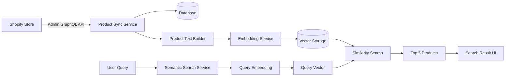

# VUCCI Shopify App — Product Synchronization & Semantic Vector Search

VUCCI là một Shopify Embedded App được xây dựng để đồng bộ dữ liệu sản phẩm từ Shopify, lưu trữ dữ liệu nội bộ, chuyển đổi dữ liệu sản phẩm thành văn bản đại diện, sinh Embedding Vector và thực hiện tìm kiếm sản phẩm theo ngữ nghĩa (Semantic Search).

Dự án được xây dựng theo yêu cầu của bài test:

> Product Synchronization & Vector Search

---

## 📋 Mục lục

- [1. Mục tiêu](#1-mục-tiêu)
- [2. Chức năng chính](#2-chức-năng-chính)
- [3. Tech Stack](#3-tech-stack)
- [4. Architecture](#4-architecture)
- [5. Installation](#5-installation)
- [6. Configuration](#6-configuration)
- [7. Shopify Setup](#7-shopify-setup)
- [8. Access Scope](#8-access-scope)
- [9. Shopify Admin GraphQL API](#9-shopify-admin-graphql-api)
- [10. Database](#10-database)
- [11. Product Synchronization](#11-product-synchronization)
- [12. Data Hash](#12-data-hash)
- [13. Embedding](#13-embedding)
- [14. Vector Storage](#14-vector-storage)
- [15. Semantic Search](#15-semantic-search)
- [16. Webhooks](#16-webhooks)
- [17. Webhook Idempotency](#17-webhook-idempotency)
- [18. Error Handling](#18-error-handling)
- [19. Large Catalog Strategy](#19-large-catalog-strategy)
- [20. Project Structure](#20-project-structure)
- [21. Development Commands](#21-development-commands)
- [22. Security](#22-security)
- [23. Testing Checklist](#23-testing-checklist)
- [24. Mandatory Questions](#24-mandatory-questions)
- [25. Scalability & Future Improvements](#25-scalability--future-improvements)
- [26. End-to-End Pipeline](#26-end-to-end-pipeline)
- [27. Requirement Mapping](#27-requirement-mapping)

---

# 1. Mục tiêu

Mục tiêu của ứng dụng là xây dựng một pipeline hoàn chỉnh:

```text
Shopify Product
      ↓
Shopify Admin GraphQL API
      ↓
Product Synchronization
      ↓
Database
      ↓
Product Search Text
      ↓
Embedding
      ↓
Vector Storage
      ↓
Semantic Search
      ↓
Top 5 Products
```

Ứng dụng tập trung vào các khả năng:

- Shopify Embedded App
- Authentication
- Access Scope
- Shopify Admin API
- Product Synchronization
- Cursor-based Pagination
- Database
- Embedding
- Vector Search
- Webhook
- Idempotency
- Error Handling

Đây là các nội dung chính được yêu cầu và đánh giá trong bài test.

---

# 2. Chức năng chính

## 2.1. Shopify Embedded App

Ứng dụng chạy trực tiếp trong Shopify Admin.

```text
Shopify Admin
      ↓
VUCCI Embedded App
```

App sử dụng cơ chế Authentication của Shopify và lưu session thông qua Prisma Session Storage.

---

## 2.2. Product Synchronization

Ứng dụng cho phép merchant đồng bộ Product từ Shopify về database của ứng dụng.

Các dữ liệu Product được đồng bộ:

- Shopify Product ID
- Title
- Description
- Vendor
- Product Type
- Tags
- Variants
- Price
- Created At
- Updated At
- Synced At

---

## 2.3. Product Variants

Một Product có thể có nhiều Variant.

Ví dụ:

```text
iPhone 17 Pro Max
├── 256GB / Black
├── 256GB / Silver
├── 512GB / Black
└── 1TB / Natural Titanium
```

Variant được lưu riêng để quản lý:

- Shopify Variant ID
- Title
- SKU
- Price
- Compare At Price
- Available For Sale
- Selected Options

---

## 2.4. Product Image

Ứng dụng lấy Product Media/Image từ Shopify để phục vụ:

- Product display
- Search result
- Product identification

Dữ liệu hình ảnh gồm:

- Image ID
- Image URL
- Alt Text

---

## 2.5. Cursor-based Pagination

Ứng dụng không giả định rằng store chỉ có một trang Product.

Ví dụ:

```text
Page 1
   ↓
hasNextPage
   ↓
endCursor
   ↓
Page 2
   ↓
hasNextPage
   ↓
endCursor
   ↓
...
   ↓
Page N
```

Cơ chế này cho phép đồng bộ catalog có số lượng Product lớn.

---

## 2.6. Semantic Search

Người dùng có thể tìm kiếm sản phẩm bằng ngôn ngữ tự nhiên.

Ví dụ:

```text
áo nam màu đen dưới 500k
```

hoặc:

```text
điện thoại cao cấp 512GB
```

Pipeline:

```text
User Query
    ↓
Query Embedding
    ↓
Query Vector
    ↓
Vector Similarity Search
    ↓
Cosine Similarity
    ↓
Ranking
    ↓
Top 5 Products
```

Kết quả gồm:

- Product Image
- Product Title
- Price
- Similarity Score

---

## 2.7. Webhook Synchronization

Ứng dụng xử lý:

```text
products/create
products/update
products/delete
```

Khi Product thay đổi trên Shopify, database và vector được cập nhật tương ứng.

---

# 3. Tech Stack

## Application

- Node.js
- TypeScript
- React
- React Router
- Vite

## Shopify

- Shopify CLI
- Shopify Embedded App
- Shopify App Bridge
- Shopify Admin GraphQL API

## Database

- SQLite
- Prisma ORM

## Authentication

- Shopify App Authentication
- Prisma Session Storage

## AI / Embedding

- Embedding API
- Configurable Embedding Model

## Vector Search

- Vector Storage
- Cosine Similarity

---

# 4. Architecture

## 4.1. High-level Architecture



---

## 4.2. Product Synchronization Flow

```text
Shopify Store
      ↓
Admin GraphQL API
      ↓
Product Sync Service
      ↓
Cursor Pagination
      ↓
Normalize Product
      ↓
Upsert Product
      ↓
Upsert Product Variants
      ↓
Calculate dataHash
      ↓
Check Semantic Data Changed
      ↓
Embedding Service
      ↓
Vector Storage
```

---

## 4.3. Webhook Flow

```text
Shopify Webhook
      ↓
Webhook Verification
      ↓
Identify Product
      ↓
Idempotent Processing
      ↓
Upsert / Update / Soft Delete
      ↓
Calculate dataHash
      ↓
Generate / Update / Remove Vector
```

---

## 4.4. Semantic Search Flow

```text
User Query
      ↓
Query Embedding
      ↓
Query Vector
      ↓
Vector Similarity Search
      ↓
Cosine Similarity
      ↓
Sort Descending
      ↓
Filter Deleted Products
      ↓
Top 5 Products
      ↓
Search Result UI
```

---

# 5. Installation

## 5.1. Requirements

Cần cài đặt:

- Node.js
- npm
- Git
- Shopify CLI

Kiểm tra môi trường:

```bash
node -v
npm -v
git --version
shopify version
```

---

## 5.2. Clone Repository

```bash
git clone <YOUR_REPOSITORY_URL>
cd vucci-app
```

---

## 5.3. Install Dependencies

```bash
npm install
```

---

## 5.4. Configure Environment

Tạo file:

```text
.env
```

dựa trên:

```text
.env.example
```

---

## 5.5. Generate Prisma Client

```bash
npx prisma generate
```

---

## 5.6. Validate Prisma Schema

```bash
npx prisma validate
```

Kết quả mong đợi:

```text
The schema at prisma/schema.prisma is valid
```

---

## 5.7. Database Migration

Development:

```bash
npx prisma migrate dev
```

Production/deployment:

```bash
npx prisma migrate deploy
```

---

## 5.8. Run Application

```bash
shopify app dev
```

Shopify CLI sẽ:

1. Khởi động development server.
2. Kết nối với Development Store.
3. Tạo development preview.
4. Tạo tunnel để Shopify Admin truy cập app local.

---

## 5.9. Prisma Studio

Kiểm tra database:

```bash
npx prisma studio
```

Thông thường Prisma Studio chạy tại:

```text
http://localhost:5555
```

---

# 6. Configuration

## 6.1. Environment Variables

Ví dụ:

```env
SHOPIFY_API_KEY=your_shopify_client_id
SHOPIFY_API_SECRET=your_shopify_client_secret

SHOPIFY_APP_URL=https://your-app-url.example.com

SCOPES=read_products

DATABASE_URL=file:dev.sqlite

OPENAI_API_KEY=your_openai_api_key

EMBEDDING_MODEL=text-embedding-3-small
```

---

## 6.2. Configuration Table

| Variable | Required | Description |
|---|---:|---|
| `SHOPIFY_API_KEY` | Yes | Shopify App Client ID |
| `SHOPIFY_API_SECRET` | Yes | Shopify App Client Secret |
| `SHOPIFY_APP_URL` | Yes | Public URL của App |
| `SCOPES` | Yes | Shopify API Access Scope |
| `DATABASE_URL` | Yes | Database connection string |
| `OPENAI_API_KEY` | Depends | API key của Embedding Provider |
| `EMBEDDING_MODEL` | Depends | Embedding model |

---

## 6.3. Environment Security

Không commit các thông tin nhạy cảm:

```text
.env
Shopify API Secret
Access Token
OpenAI API Key
Database credentials
```

Repository chỉ nên chứa:

```text
.env.example
```

---

# 7. Shopify Setup

## 7.1. Development Store

App được phát triển và kiểm thử trên Shopify Development Store.

Ví dụ:

```text
vucci-k27ubgmn.myshopify.com
```

---

## 7.2. Create App

Project được khởi tạo bằng:

```bash
shopify app init
```

Template:

```text
React Router
```

Language:

```text
TypeScript
```

---

## 7.3. Embedded App

App được cấu hình chạy trong Shopify Admin:

```toml
embedded = true
```

---

## 7.4. Shopify Server

Cấu hình Shopify được quản lý trong:

```text
app/shopify.server.ts
```

Các thành phần chính:

```text
API Key
API Secret
API Version
Scopes
App URL
Session Storage
Authentication
Webhook Registration
```

---

# 8. Access Scope

## 8.1. Scope sử dụng

Đối với chức năng đọc Product:

```text
read_products
```

Scope này phục vụ việc đọc dữ liệu:

- Product
- Product Variant
- Product-related data cần thiết cho synchronization

---

## 8.2. Principle of Least Privilege

App chỉ nên yêu cầu những quyền cần thiết cho chức năng hiện tại.

Trong phạm vi bài test:

```text
Read Product
      ↓
Sync Product
      ↓
Generate Embedding
      ↓
Semantic Search
```

Không cần quyền ghi Product chỉ để thực hiện synchronization và search.

---

## 8.3. Nếu cần chỉnh sửa Product trong tương lai

Nếu App cần:

```text
Update Product Title
Update Product Description
Update Product
```

thì cần access scope phù hợp cho quyền ghi Product, ví dụ:

```text
write_products
```

Sau đó cần cập nhật configuration và authorization/re-consent flow tương ứng.

---

# 9. Shopify Admin GraphQL API

Product được lấy thông qua Shopify Admin GraphQL API.

Query sử dụng:

```graphql
query GetProducts($first: Int!, $after: String) {
  products(first: $first, after: $after) {
    nodes {
      id
      title
      description
      vendor
      productType
      tags
      createdAt
      updatedAt

      variants(first: 100) {
        nodes {
          id
          title
          sku
          price
          compareAtPrice
          availableForSale

          selectedOptions {
            name
            value
          }
        }
      }

      media(first: 5) {
        nodes {
          id
          alt

          ... on MediaImage {
            image {
              url
            }
          }
        }
      }
    }

    pageInfo {
      hasNextPage
      endCursor
    }
  }
}
```

---

# 10. Database

## 10.1. Database Technology

Development:

```text
SQLite
```

ORM:

```text
Prisma
```

Database file:

```text
dev.sqlite
```

---

## 10.2. Session Model

Model:

```text
Session
```

được sử dụng cho Shopify Authentication.

Các dữ liệu chính:

```text
id
shop
state
isOnline
scope
expires
accessToken
userId
firstName
lastName
email
accountOwner
locale
collaborator
emailVerified
refreshToken
refreshTokenExpires
```

---

## 10.3. Product Model

Model:

```text
Product
```

Các field:

```text
id
shopifyProductId
title
description
vendor
productType
tags
imageUrl
shopifyCreatedAt
shopifyUpdatedAt
syncedAt
dataHash
createdAt
updatedAt
deletedAt
```

### `shopifyProductId`

ID của Product trên Shopify.

Field này là unique:

```text
shopifyProductId UNIQUE
```

để tránh tạo duplicate.

### `shopifyCreatedAt`

Thời gian Product được tạo trên Shopify.

### `shopifyUpdatedAt`

Thời gian Product được cập nhật trên Shopify.

### `syncedAt`

Thời gian Product được đồng bộ gần nhất vào database app.

### `dataHash`

SHA-256 hash của nội dung semantic search.

### `deletedAt`

Dùng cho soft delete.

---

## 10.4. ProductVariant Model

Model:

```text
ProductVariant
```

Các field:

```text
id
productId
shopifyVariantId
title
sku
price
compareAtPrice
availableForSale
options
```

Quan hệ:

```text
Product 1
   │
   ├── ProductVariant
   ├── ProductVariant
   └── ProductVariant
```

`shopifyVariantId` được đặt unique để tránh duplicate.

---

# 11. Product Synchronization

## 11.1. Manual Sync

Merchant thực hiện:

```text
Products
   ↓
Sync Products
```

App bắt đầu:

```text
Shopify API
   ↓
Fetch Products
   ↓
Cursor Pagination
   ↓
Normalize
   ↓
Database
```

---

## 11.2. Cursor Pagination

Các tham số:

```text
first
after
hasNextPage
endCursor
```

Logic:

```text
cursor = null

Fetch Page 1
      ↓
Read pageInfo
      ↓
hasNextPage?
   ┌──────┴──────┐
  Yes            No
   ↓              ↓
Use endCursor    Finish
   ↓
Fetch next page
```

Điều này đảm bảo toàn bộ Product được đồng bộ ngay cả khi catalog lớn.

---

## 11.3. Product Upsert

Product sử dụng:

```text
shopifyProductId
```

làm khóa nhận diện.

Logic:

```text
Product chưa tồn tại
      ↓
CREATE

Product đã tồn tại
      ↓
UPDATE
```

Ví dụ:

```ts
await prisma.product.upsert({
  where: {
    shopifyProductId: product.id,
  },
  create: {
    // Product data
  },
  update: {
    // Updated Product data
  },
});
```

---

## 11.4. Variant Upsert

Variant sử dụng:

```text
shopifyVariantId
```

làm khóa unique.

Logic:

```text
Variant chưa tồn tại
      ↓
CREATE

Variant đã tồn tại
      ↓
UPDATE
```

---

## 11.5. Variant Deletion

Nếu một Variant không còn xuất hiện trong Product data từ Shopify:

```text
Shopify Variants
      ↓
Current Variant IDs
      ↓
Compare Existing Variant IDs
      ↓
Delete old variants
```

để database không giữ dữ liệu stale.

---

# 12. Data Hash

## 12.1. Purpose

`dataHash` được sử dụng để xác định liệu nội dung semantic của Product có thay đổi hay không.

---

## 12.2. Search Text

Các dữ liệu được sử dụng để tạo Search Text:

```text
Title
Vendor
Product Type
Description
Tags
Variants
Price
```

Ví dụ:

```text
Tên sản phẩm: iPhone 17 Pro Max
Nhà cung cấp: Apple
Loại sản phẩm: Smartphone
Mô tả: Điện thoại cao cấp...
Tags: iphone, apple, smartphone

Variants:
256GB / Black
512GB / Black
1TB / Natural Titanium

Giá:
34990000 - 39990000
```

---

## 12.3. Hash Pipeline

```text
Product Data
      ↓
Normalize
      ↓
Build Search Text
      ↓
SHA-256
      ↓
dataHash
```

---

## 12.4. Hash Comparison

Nếu:

```text
oldHash === newHash
```

thì:

```text
Semantic content không thay đổi
      ↓
Không tạo Embedding mới
```

Nếu:

```text
oldHash !== newHash
```

thì:

```text
Semantic content thay đổi
      ↓
Generate new Embedding
      ↓
Update Vector
```

---

# 13. Embedding

## 13.1. Embedding Pipeline

```text
Product Search Text
      ↓
Embedding Model
      ↓
Float Vector
```

---

## 13.2. Embedding Model

Embedding model được cấu hình qua:

```env
EMBEDDING_MODEL=...
```

Provider/API key được cấu hình qua:

```env
OPENAI_API_KEY=...
```

Ví dụ:

```env
EMBEDDING_MODEL=text-embedding-3-small
```

---

## 13.3. Product Embedding

Ví dụ:

```text
Product:

iPhone 17 Pro Max
Apple
Smartphone
512GB
Black
```

được chuyển thành một vector:

```text
[0.012, -0.045, 0.123, ...]
```

Vector này đại diện cho ngữ nghĩa của Product.

---

# 14. Vector Storage

Vector được lưu để phục vụ Semantic Search.

Logical relationship:

```text
Product
   │
   └── ProductVector
```

Thông tin vector:

```text
productId
embedding
model
dimensions
contentHash
createdAt
updatedAt
```

Ví dụ:

```json
{
  "productId": "product-id",
  "model": "text-embedding-3-small",
  "dimensions": 1536,
  "embedding": [
    0.012,
    -0.045,
    0.123
  ]
}
```

Số chiều thực tế phải khớp với embedding model đang sử dụng.

---

# 15. Semantic Search

## 15.1. Search Pipeline

```text
User Query
      ↓
Query Embedding
      ↓
Query Vector
      ↓
Vector Similarity
      ↓
Cosine Similarity
      ↓
Ranking
      ↓
Top 5
```

---

## 15.2. Query Example

Người dùng nhập:

```text
áo nam màu đen dưới 500k
```

Hệ thống thực hiện:

```text
"áo nam màu đen dưới 500k"
      ↓
Embedding
      ↓
Query Vector
```

Sau đó so sánh Query Vector với Product Vectors.

---

## 15.3. Cosine Similarity

Công thức:

```text
                    Q · P
Cosine(Q,P) = ---------------------
              ||Q|| × ||P||
```

Trong đó:

```text
Q = Query Vector
P = Product Vector
```

Giá trị càng cao thì mức độ tương đồng ngữ nghĩa càng lớn.

---

## 15.4. Ranking

Kết quả được sắp xếp:

```text
Similarity Score DESC
```

Ví dụ:

```text
Product A → 0.94
Product B → 0.89
Product C → 0.83
Product D → 0.79
Product E → 0.74
```

Sau đó trả về:

```text
Top 5 Products
```

---

## 15.5. Search Result

Mỗi kết quả tối thiểu hiển thị:

```text
Product Image
Product Title
Price
Similarity Score
```

Ví dụ:

```text
┌───────────────────────────────────┐
│ [IMAGE]                           │
│                                   │
│ iPhone 17 Pro Max                 │
│ Price: 39.990.000 ₫               │
│ Similarity: 92.4%                 │
└───────────────────────────────────┘
```

---

# 16. Webhooks

## 16.1. Product Created

Khi Product được tạo:

```text
products/create
      ↓
Webhook Handler
      ↓
Get Product
      ↓
Upsert Product
      ↓
Calculate dataHash
      ↓
Generate Embedding
      ↓
Store Vector
```

---

## 16.2. Product Updated

Khi Product được cập nhật:

```text
products/update
      ↓
Webhook Handler
      ↓
Update Product
      ↓
Calculate dataHash
      ↓
Compare Hash
```

Nếu:

```text
Hash unchanged
```

thì:

```text
Skip Embedding
```

Nếu:

```text
Hash changed
```

thì:

```text
Generate new Embedding
      ↓
Update Vector
```

---

## 16.3. Product Deleted

Khi Product bị xóa:

```text
products/delete
      ↓
Webhook Handler
      ↓
Soft Delete Product
      ↓
Remove / Disable Vector
```

Ứng dụng sử dụng:

```text
deletedAt
```

để đánh dấu Product đã bị xóa.

---

# 17. Webhook Idempotency

Shopify có thể gửi lại cùng một Webhook nhiều lần.

Do đó ứng dụng phải xử lý theo hướng idempotent.

---

## 17.1. Database Idempotency

Product:

```text
shopifyProductId UNIQUE
```

Variant:

```text
shopifyVariantId UNIQUE
```

Kết hợp với:

```text
upsert()
```

---

## 17.2. Example

Webhook 1:

```text
products/update
      ↓
upsert Product
```

Webhook 2:

```text
products/update
      ↓
upsert same Product
```

Kết quả:

```text
1 Product
0 Duplicate
```

---

## 17.3. Vector Idempotency

Kết hợp với:

```text
dataHash
```

Nếu Webhook được gửi lại nhưng nội dung semantic không đổi:

```text
same Product
      ↓
same dataHash
      ↓
Skip Embedding
```

Điều này vừa đảm bảo idempotency vừa tiết kiệm chi phí Embedding.

---

# 18. Error Handling

Ứng dụng phải xử lý an toàn các tình huống:

```text
Shopify API Error
Embedding API Error
Webhook Retry
Product Deleted
Missing Description
Missing Tags
Missing Variants
Sync Failure
Rate Limit
```

---

## 18.1. Shopify API Error

Không để application crash.

Có thể:

```text
Catch Error
      ↓
Log Error
      ↓
Return Safe Response
```

---

## 18.2. Embedding API Error

Nếu Embedding API thất bại:

```text
Product đã sync vào Database
      ↓
Embedding failed
      ↓
Log Error
      ↓
Retry / Queue
```

Product không nên mất chỉ vì Embedding API tạm thời unavailable.

---

## 18.3. Missing Data

Product có thể thiếu:

```text
Description
Tags
Variants
```

App phải sử dụng fallback:

```text
description = ""
tags = []
variants = []
```

thay vì crash.

---

# 19. Large Catalog Strategy

## 19.1. 100.000 Products

Với:

```text
100.000 Products
```

một synchronous HTTP request sẽ có nhiều vấn đề:

- Request timeout
- Shopify API throttling
- Embedding API rate limit
- Database bottleneck
- Memory pressure
- Sync failure giữa chừng

---

## 19.2. Shopify Bulk Operations

Đối với catalog lớn, có thể chuyển từ pagination thông thường sang:

```text
Shopify Bulk Operations
```

Flow:

```text
Sync Request
      ↓
Bulk Operation
      ↓
Shopify xử lý
      ↓
JSONL Result
      ↓
Worker
      ↓
Batch Processing
```

---

## 19.3. Background Queue

Production architecture:

```text
Sync Request
      ↓
Queue
      ↓
Worker
      ↓
Shopify Data
      ↓
Database
      ↓
Embedding
      ↓
Vector Storage
```

Các công nghệ có thể sử dụng:

```text
Redis
BullMQ
RabbitMQ
Cloud Tasks
```

---

## 19.4. Batch Embedding

Thay vì:

```text
Product 1 → API
Product 2 → API
Product 3 → API
...
```

có thể:

```text
100 Products
      ↓
Batch Embedding Request
```

giảm số lượng network round-trip.

---

## 19.5. Production Database

Development:

```text
SQLite
```

Production có thể chuyển sang:

```text
PostgreSQL
+
pgvector
```

hoặc Vector Database chuyên dụng:

```text
Qdrant
Milvus
Pinecone
```

---

# 20. Project Structure

```text
vucci-app/
│
├── app/
│   │
│   ├── routes/
│   │   ├── app._index.tsx
│   │   └── ...
│   │
│   ├── services/
│   │   ├── product-sync.server.ts
│   │   ├── embedding.server.ts
│   │   └── semantic-search.server.ts
│   │
│   ├── db.server.ts
│   ├── shopify.server.ts
│   └── ...
│
├── prisma/
│   ├── schema.prisma
│   └── migrations/
│
├── extensions/
│
├── public/
│
├── .env.example
├── .gitignore
├── package.json
├── package-lock.json
├── shopify.app.toml
├── shopify.web.toml
├── vite.config.ts
├── tsconfig.json
└── README.md
```

---

# 21. Development Commands

## Install Dependencies

```bash
npm install
```

## Start Shopify App

```bash
shopify app dev
```

## Validate Prisma

```bash
npx prisma validate
```

## Generate Prisma Client

```bash
npx prisma generate
```

## Development Migration

```bash
npx prisma migrate dev
```

## Migration Status

```bash
npx prisma migrate status
```

## Production Migration

```bash
npx prisma migrate deploy
```

## Prisma Studio

```bash
npx prisma studio
```

---

# 22. Security

## 22.1. Secrets

Không commit:

```text
.env
SHOPIFY_API_SECRET
SHOPIFY_ACCESS_TOKEN
OPENAI_API_KEY
DATABASE_PASSWORD
```

---

## 22.2. Webhook Verification

Webhook phải được xác minh trước khi xử lý.

Flow:

```text
Incoming Webhook
      ↓
Verify Signature / HMAC
      ↓
Valid?
   ┌──────┴──────┐
  Yes            No
   ↓              ↓
Process          Reject
```

---

## 22.3. Access Control

Chỉ yêu cầu những Shopify Access Scope cần thiết.

Không xin thêm permission nếu feature không sử dụng.

---

# 23. Testing Checklist

## Shopify App

- [x] Shopify App created
- [x] Development Store
- [x] Embedded App
- [x] Authentication
- [x] Admin GraphQL API

## Product API

- [x] Product Query
- [x] Description
- [x] Vendor
- [x] Product Type
- [x] Tags
- [x] Variants
- [x] Price
- [x] Image
- [x] Created At
- [x] Updated At

## Product Synchronization

- [x] Cursor Pagination
- [x] Product Upsert
- [x] Variant Upsert
- [x] `syncedAt`
- [x] `dataHash`
- [x] Deleted Product Handling

## Embedding

- [x] Product Search Text
- [x] Embedding Generation
- [x] Data Hash Optimization

## Semantic Search

- [x] Query Embedding
- [x] Vector Search
- [x] Cosine Similarity
- [x] Ranking
- [x] Top 5
- [x] Similarity Score

## Webhooks

- [x] `products/create`
- [x] `products/update`
- [x] `products/delete`
- [x] Idempotent Processing
- [x] Vector Synchronization

## Error Handling

- [x] Shopify API Error
- [x] Embedding API Error
- [x] Missing Product Data
- [x] Webhook Retry
- [x] Deleted Product
- [x] Sync Failure

---

# 24. Mandatory Questions

## Question 1 — App cần những Shopify Access Scope nào? Tại sao?

Scope cần thiết cho chức năng đọc Product:

```text
read_products
```

Lý do:

1. App cần đọc Product từ Shopify.
2. App cần đọc Product Variant.
3. Dữ liệu được đồng bộ về database nội bộ.
4. Product data sau đó được dùng cho Embedding và Semantic Search.
5. App không cần chỉnh sửa Product trong phạm vi bài test.
6. Tuân thủ Principle of Least Privilege.

---

## Question 2 — Nếu shop có 100.000 sản phẩm, Sync hiện tại có vấn đề gì?

Các vấn đề:

1. Request có thể timeout.
2. Shopify GraphQL API có rate limit/throttling.
3. Embedding API có request/token limits.
4. Database có thể trở thành bottleneck.
5. Một lỗi giữa chừng có thể làm toàn bộ sync thất bại.

Giải pháp:

```text
Shopify Bulk Operations
        ↓
Background Queue
        ↓
Worker
        ↓
Batch Database Upsert
        ↓
Batch Embedding
        ↓
Vector Storage
```

---

## Question 3 — Nếu Shopify gửi cùng một Product Update Webhook 2 lần?

Hệ thống dùng:

```text
shopifyProductId UNIQUE
```

và:

```text
product.upsert()
```

Do đó:

```text
Webhook #1
      ↓
UPDATE

Webhook #2
      ↓
UPDATE
```

không tạo duplicate.

Nếu `dataHash` không đổi:

```text
Skip Embedding
```

---

## Question 4 — Product chỉ thay đổi Inventory nhưng semantic content không thay đổi. Có cần tạo lại embedding?

Không.

Ví dụ:

```text
Inventory:
20 → 19
```

nhưng:

```text
Title
Description
Vendor
Product Type
Tags
Variants
Price
```

không thay đổi.

Khi đó:

```text
Search Text không đổi
      ↓
dataHash không đổi
      ↓
Không tạo Embedding mới
```

Điều này giảm chi phí và tránh xử lý không cần thiết.

---

## Question 5 — Nếu sau này App cần cập nhật Product Title lên Shopify?

Cần quyền ghi Product phù hợp, ví dụ:

```text
write_products
```

Sau đó:

1. Cập nhật Access Scope.
2. Cập nhật authorization configuration.
3. Thực hiện re-consent nếu cần.
4. Sử dụng Shopify Admin GraphQL mutation phù hợp.

Ví dụ:

```graphql
mutation UpdateProduct($product: ProductUpdateInput!) {
  productUpdate(product: $product) {
    product {
      id
      title
    }

    userErrors {
      field
      message
    }
  }
}
```

---

# 25. Scalability & Future Improvements

## Database

- PostgreSQL
- pgvector
- Database indexing
- Read replicas

## Sync

- Shopify Bulk Operations
- Incremental Sync
- Background Jobs
- Queue
- Retry
- Rate-limit handling
- Batch writes

## Embedding

- Batch Embedding
- Embedding cache
- Multiple models
- Retry
- Provider fallback

## Search

- Hybrid Search
- Keyword Search + Vector Search
- Metadata Filtering
- Category Filtering
- Vendor Filtering
- Price Filtering
- Availability Filtering

## Observability

- Structured Logging
- Sync Metrics
- Webhook Metrics
- Embedding Metrics
- Search Metrics
- Error Monitoring

---

# 26. End-to-End Pipeline

Toàn bộ hệ thống:

```text
                         SHOPIFY
                            │
                            ▼
                  Shopify Admin GraphQL
                            │
                            ▼
                  Product Sync Service
                            │
                ┌───────────┴───────────┐
                │                       │
                ▼                       ▼
           Pagination                Normalize
                │                       │
                └───────────┬───────────┘
                            ▼
                         Prisma
                            │
                ┌───────────┴───────────┐
                ▼                       ▼
             Product                 Variants
                │
                ▼
          Product Search Text
                │
                ▼
             dataHash
                │
                ▼
         Embedding Service
                │
                ▼
          Vector Storage
                │
                │
User Query ─────┘
      │
      ▼
Query Embedding
      │
      ▼
Query Vector
      │
      ▼
Cosine Similarity
      │
      ▼
Ranking
      │
      ▼
Top 5 Products
      │
      ▼
Search Result UI
```

---

# 27. Requirement Mapping

| Requirement | Implementation |
|---|---|
| Shopify App Setup | Shopify CLI + React Router |
| Authentication | Shopify App Authentication |
| Access Scope | Product access scope |
| Shopify Product API | Admin GraphQL API |
| Product Sync | Product Sync Service |
| Pagination | Cursor-based Pagination |
| Database | Prisma + SQLite |
| Product | Product Model |
| Variants | ProductVariant Model |
| Embedding | Embedding Service |
| Vector Storage | Product Vector Storage |
| Semantic Search | Vector Similarity |
| Similarity | Cosine Similarity |
| Search Ranking | Similarity DESC |
| Result Count | Top 5 |
| Product Created Webhook | `products/create` |
| Product Updated Webhook | `products/update` |
| Product Deleted Webhook | `products/delete` |
| Idempotency | Unique Shopify IDs + Upsert |
| Embedding Optimization | SHA-256 `dataHash` |
| Error Handling | API/Data/Webhook handling |
| Large Catalog | Bulk Operations + Queue |
| Documentation | README |
